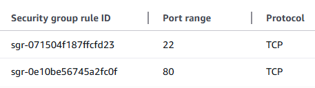

AWS EC2 Nginx Website Deployment

This project demonstrates how to deploy a static website on an AWS EC2 Ubuntu server using Nginx.

Live Demo
Website: http://43.209.177.148
GitHub Repository: https://github.com/sjsiwat/AWS-EC2-nginx-website
Technologies Used
AWS EC2
Ubuntu Linux
Nginx
SSH
SCP
HTML
CSS
GitHub
Deployment Flow
VS Code
↓
GitHub
↓
SCP Upload
↓
EC2 Ubuntu Server
↓
Nginx
↓
Public Website
What I Learned
How to launch and manage an EC2 instance
How to connect to a Linux server using SSH
How Security Groups work
How to deploy website files using SCP
How Nginx serves static files
How Linux file permissions affect deployments

## Security Group Configuration

